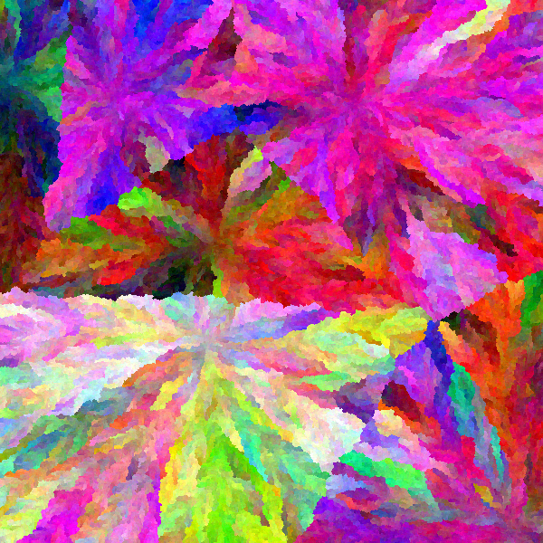

# PIE
## Summary
Photon's Image Experiments is a project created out of pure curiosity and boredom.
In here you can find a collection of little gizmos (expect it to grow in the future!) which are all based around creating images in a certain way.

Make sure to also look in the Examples section for some results this software can produce!

## Examples
### Flow
 
 
 
